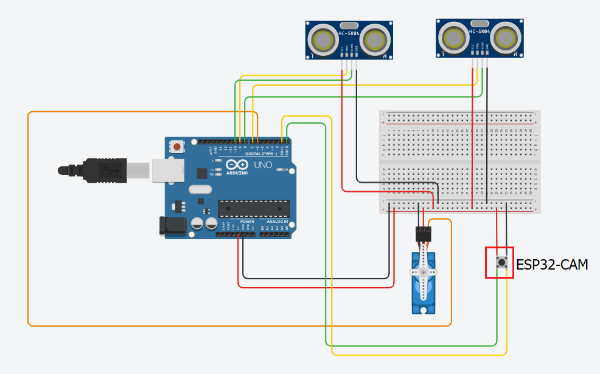

# Smart Bin - a recycle bin that can auto open and measure rubbish percent

## Requirements
<br/>

Download those library, extract file and move to arduino libraries in your computer:

- [ESPAsyncWebServer](https://github.com/espressif/arduino-esp32)
- [AsyncTCP](https://github.com/me-no-dev/AsyncTCP)
- [ArduinoJson](https://github.com/bblanchon/ArduinoJson)
- [blynk-library](https://github.com/blynkkk/blynk-library)

Library folder is usually located at path 
```
C:\Users\Admin\Documents\Arduino\libraries
```
<br/>
<br/>

## Circuit Diagram
<br/>



<br/>
<br/>

## User guide
<br/>

- Step 1: change ssid and passwork in `BinESP32.ino` to match your network.
- Step 2: upload `BinESP32.ino` to `ESP32`.
- Step 3: upload `BinArduino.ino` to `Arduino` (remember to leave TX, RX blank when upload).
- Step 4: wiring component as our circuit diagram.
- Step 5: If you still connect `Arduino` to your computer, you will see `IP` of `ESP32` be printed to Serial (`15200 baud`).
- Step 6: access `ESP32` via `web browser` our use `Bynk app` on mobile phone to see rubbish percent or remote open bin.